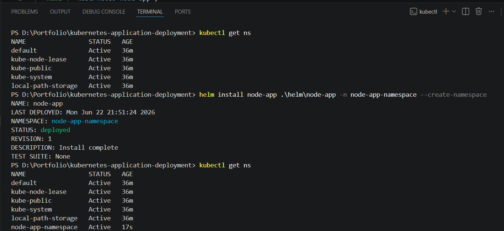
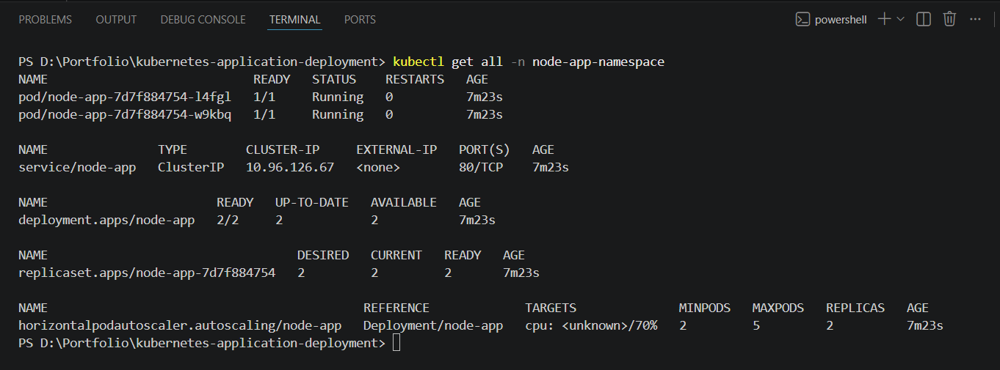
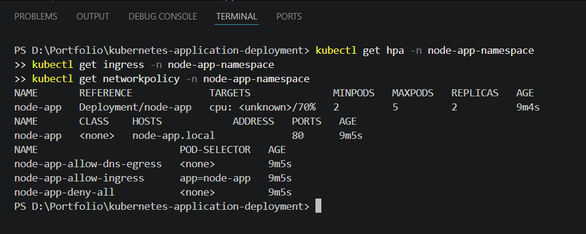
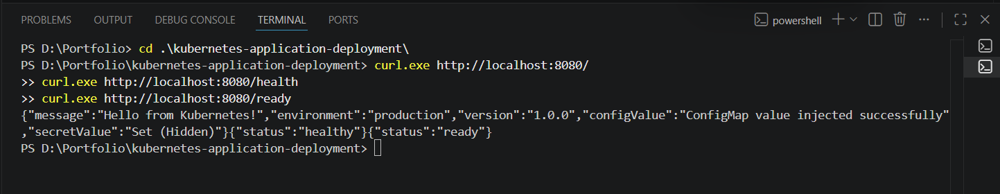
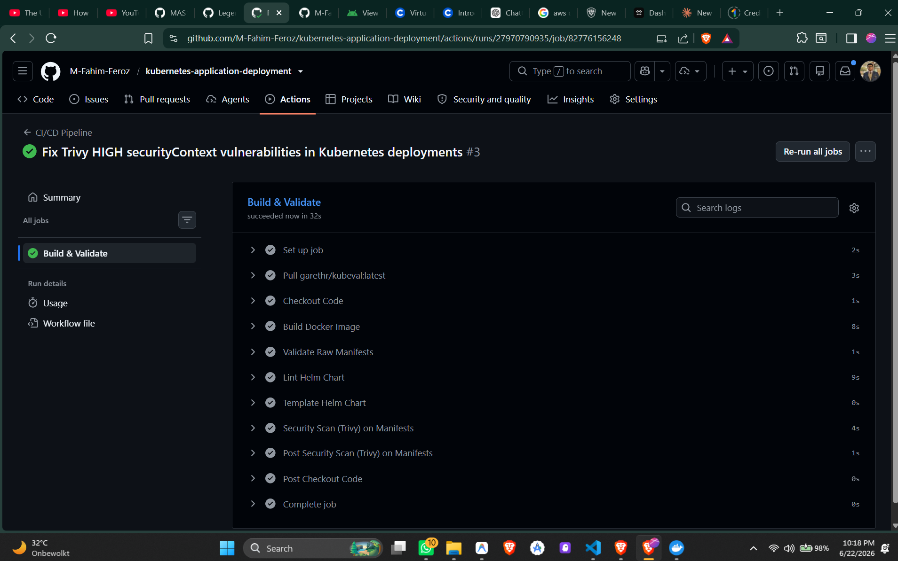

# Kubernetes Application Deployment with Helm, HPA, and Ingress

[](https://github.com/M-Fahim-Feroz/kubernetes-application-deployment/actions/workflows/ci.yml)
[](LICENSE)


> **GitHub Repo Description:** Kubernetes deployment project with Docker, raw manifests, Helm, Ingress, HPA, probes, resource limits, NetworkPolicy, and GitHub Actions validation.
> **Topics:** `kubernetes`, `helm`, `docker`, `ingress`, `hpa`, `devops`, `cloud`, `github-actions`, `kubernetes-manifests`, `trivy`

## 1. Project Overview
This repository serves as a showcase of Kubernetes application deployment fundamentals. It demonstrates how to containerize a microservice, deploy it securely and reliably to a Kubernetes cluster using raw manifests, and package it using Helm for automated management. 

## 2. What This Project Demonstrates
For hiring managers and technical interviewers, this project proves my ability to:
- Write optimized, multi-stage **Dockerfiles** following security best practices (e.g., non-root users).
- Structure **Raw Kubernetes Manifests** including Deployments, Services (ClusterIP), ConfigMaps, Secrets, Ingress, and Network Policies.
- Implement robust reliability features like **Liveness and Readiness Probes** and strict **Resource Requests and Limits**.
- Dynamically scale applications using the **Horizontal Pod Autoscaler (HPA)** based on CPU utilization.
- Author reusable **Helm Charts** to parameterize deployments for various environments.
- Establish a **GitHub Actions CI Pipeline** to statically validate manifests and scan for security misconfigurations.

## Project Highlights

- **Declarative Kubernetes deployment** — all workloads defined as raw YAML manifests covering Deployments, Services, ConfigMaps, Secrets, Ingress, HPA, and NetworkPolicy
- **Helm chart packaging** — same app packaged as a Helm chart with templated values for multi-environment parameterization
- **Security-first design** — non-root container user, NetworkPolicy restricting pod-to-pod traffic, resource requests/limits, and liveness/readiness probes on every deployment
- **CI-validated manifests** — GitHub Actions runs Trivy container scan and kubeconform manifest validation on every pull request
- **IMAGE_TAG injection** — CI replaces `IMAGE_TAG` placeholder in deployment manifests with the Git commit SHA at runtime using `sed`, preventing stale image pulls
- **Local rendering workflow** — `make k8s-deploy-rendered IMAGE_TAG=v1.0.0` renders and deploys manifests locally without requiring CI

## 3. Architecture

> See the [full architecture diagram](docs/architecture.md) with Mermaid flowcharts.

The application is a simple Node.js REST API designed to demonstrate environment injection and Kubernetes probing.


## 4. Tech Stack
- **Application**: Node.js, Express
- **Containerization**: Docker
- **Orchestration**: Kubernetes (Minikube / Docker Desktop)
- **Package Management**: Helm
- **CI/CD & Security**: GitHub Actions, Kubeconform, Trivy

## 5. Local Setup
You can run this project locally using Docker Desktop (with Kubernetes enabled) or Minikube.

1. **Clone the repository:**
   ```bash
   git clone https://github.com/M-Fahim-Feroz/kubernetes-application-deployment.git
   cd kubernetes-application-deployment
   ```
2. **Build the Docker Image:**
   ```bash
   make docker-build
   ```

## 6. Raw Manifest Deployment
To avoid deploying the literal `IMAGE_TAG` placeholder during local testing, you should use the rendering deployment targets.

To specify a custom tag and deploy using standard Kubernetes YAML files:
```bash
make docker-build IMAGE_TAG=v1.0.0
make k8s-deploy-rendered IMAGE_TAG=v1.0.0
```
This renders the manifests into a local `.rendered/` directory and applies the Namespace, ConfigMap, Secret, Deployment, Service, Ingress, HPA, and NetworkPolicy.

*(Alternatively, to strictly deploy un-rendered raw templates without tag injection, run `make k8s-apply`)*

**Safe Cleanup:**
To delete the resources without deleting the namespace (recommended to avoid conflicts with Helm later):
```bash
make k8s-delete
```
To completely destroy everything including the namespace:
```bash
make k8s-delete-all
```

## 7. Helm Deployment
> [!WARNING]
> Do not run `kubectl delete -f k8s/` or `make k8s-delete-all` immediately before a Helm install. Deleting a namespace can take time, and Kubernetes will keep it in a `Terminating` state, which causes Helm installations to fail with `forbidden` errors. Always use `make k8s-delete` or ensure the namespace is fully terminated first.

To deploy using the parameterized Helm chart:
```bash
# Validate and view the generated manifests
make helm-lint
make helm-template

# Install the chart
make helm-install
```
To clean up:
```bash
make helm-uninstall
```

### Windows Manual Commands (Without Make)
If `make` is unavailable on Windows, use these PowerShell equivalents:

**Raw Manifests:**
- Apply: `kubectl apply -f k8s/namespace.yaml; kubectl apply -f k8s/configmap.yaml; kubectl apply -f k8s/secret.yaml; kubectl apply -f k8s/deployment.yaml; kubectl apply -f k8s/service.yaml; kubectl apply -f k8s/ingress.yaml; kubectl apply -f k8s/hpa.yaml; kubectl apply -f k8s/networkpolicy.yaml`
- Safe Delete: `kubectl delete -f k8s/networkpolicy.yaml,k8s/hpa.yaml,k8s/ingress.yaml,k8s/service.yaml,k8s/deployment.yaml,k8s/secret.yaml,k8s/configmap.yaml`
- Delete All: `kubectl delete -f k8s/`

**Helm:**
- Lint: `helm lint helm/node-app/`
- Template: `helm template node-app helm/node-app/`
- Install: `helm install node-app helm/node-app/ -n node-app-namespace --create-namespace`
- Uninstall: `helm uninstall node-app -n node-app-namespace`
- Reset: `helm uninstall node-app -n node-app-namespace`

## 8. CI Validation
The `.github/workflows/ci.yml` pipeline automatically ensures code quality and security on every push:
- Validates the Docker build.
- Injects the dynamic commit SHA (`${{ github.sha }}`) into the deployment manifest to enforce unique image tags instead of using `latest`.
- Lints the Kubernetes YAML using `kubeconform`.
- Verifies the Helm chart using `helm lint`.
- Scans the Kubernetes manifests for security misconfigurations using **Trivy**.

## 9. Screenshots / Proof of Work

**Helm Install Success:**


**Kubernetes Resources (kubectl get all):**


**HPA, Ingress, & NetworkPolicy:**


**Port Forwarding & Curl Test:**


**GitHub Actions CI Pipeline Success:**


## 10. Release & Changelog
### Suggested First Release
- **v1.0.0**: Initial portfolio-ready release.
  - Includes full CI/CD pipeline, security cleanup, and structured deployment documentation.
- See `CHANGELOG.md` for a complete history of updates.
- It is highly recommended to leverage [GitHub Releases](https://docs.github.com/en/repositories/releasing-projects-on-github/about-releases) to bundle version tags cleanly.

## 11. Portfolio Scope / Related Projects
**Important Note:** This repository strictly focuses on Kubernetes application deployment patterns (Helm, HPA, Probes, etc.). 
To keep my portfolio modular and focused:
- **AWS Infrastructure, Terraform, and EKS** are intentionally handled in a **separate portfolio project**.
- **Advanced GitOps (ArgoCD), Monitoring (Prometheus/Grafana), and Automated TLS (Cert-Manager)** are implemented in other dedicated repositories.

### Future Roadmap
- Implementation of a full end-to-end `kind` cluster integration test in the GitHub Actions CI pipeline to dynamically test Helm installations prior to merge.

I do not claim AWS, Terraform, or cloud vendor implementation within this specific repository.

## 11. CV Bullets
*(If you are reading this from my resume, here is what this repository correlates to)*
- Engineered a complete Kubernetes deployment lifecycle for a Node.js microservice using both raw declarative manifests and Helm charts.
- Ensured application reliability and security by implementing readiness/liveness probes, strict resource limits, Network Policies, and non-root Docker images.
- Implemented autoscaling strategies utilizing the Horizontal Pod Autoscaler (HPA) to scale pods dynamically based on CPU utilization.
- Built a GitHub Actions CI pipeline to statically validate Kubernetes manifests and perform Trivy security configuration scanning.
