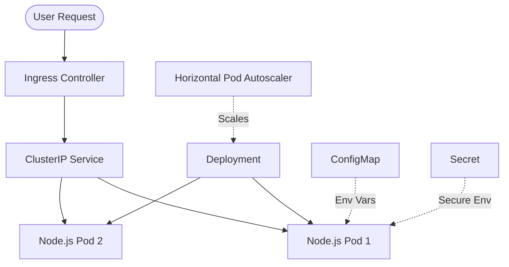

# Kubernetes Application Deployment with Helm, HPA, and Ingress


## 1. Project Overview
This repository serves as a showcase of Kubernetes application deployment fundamentals. It demonstrates how to containerize a microservice, deploy it securely and reliably to a Kubernetes cluster using raw manifests, and package it using Helm for automated management. 

## 2. What This Project Demonstrates
For hiring managers and technical interviewers, this project proves my ability to:
- Write optimized, multi-stage **Dockerfiles** following security best practices (e.g., non-root users).
- Structure **Raw Kubernetes Manifests** including Deployments, Services (ClusterIP), ConfigMaps, Secrets, Ingress, and Network Policies.
- Implement robust reliability features like **Liveness and Readiness Probes** and strict **Resource Requests and Limits**.
- Dynamically scale applications using the **Horizontal Pod Autoscaler (HPA)** based on CPU utilization.
- Author reusable **Helm Charts** to parameterize deployments for various environments.
- Establish a **GitHub Actions CI Pipeline** to statically validate manifests and scan for security misconfigurations.

## 3. Architecture
The application is a simple Node.js REST API designed to demonstrate environment injection and Kubernetes probing.



## 4. Tech Stack
- **Application**: Node.js, Express
- **Containerization**: Docker
- **Orchestration**: Kubernetes (Minikube / Docker Desktop)
- **Package Management**: Helm
- **CI/CD & Security**: GitHub Actions, Kubeval, Trivy

## 5. Local Setup
You can run this project locally using Docker Desktop (with Kubernetes enabled) or Minikube.

1. **Clone the repository:**
   ```bash
   git clone https://github.com/your-username/kubernetes-application-deployment.git
   cd kubernetes-application-deployment
   ```
2. **Build the Docker Image:**
   ```bash
   make docker-build
   ```

## 6. Raw Manifest Deployment
To deploy using standard Kubernetes YAML files:
```bash
make k8s-apply
```
This applies the Namespace, ConfigMap, Secret, Deployment, Service, Ingress, HPA, and NetworkPolicy.
To clean up:
```bash
make k8s-delete
```

## 7. Helm Deployment
To deploy using the parameterized Helm chart:
```bash
# Validate and view the generated manifests
make helm-lint
make helm-template

# Install the chart
make helm-install
```
To clean up:
```bash
make helm-uninstall
```

## 8. CI Validation
The `.github/workflows/ci.yml` pipeline automatically ensures code quality and security on every push:
- Validates the Docker build.
- Lints the Kubernetes YAML using `kubeval`.
- Verifies the Helm chart using `helm lint`.
- Scans the Kubernetes manifests for security misconfigurations using **Trivy**.

## 9. Screenshots / Proof of Work
*(Placeholders for future screenshots)*
- **CI Pipeline Success:** `docs/screenshots/ci-success.png`
- **Pods Running & HPA Metrics:** `docs/screenshots/kubectl-get-all.png`
- **Helm Release Status:** `docs/screenshots/helm-ls.png`

## 10. Portfolio Scope / Related Projects
**Important Note:** This repository strictly focuses on Kubernetes application deployment patterns (Helm, HPA, Probes, etc.). 
To keep my portfolio modular and focused:
- **AWS Infrastructure, Terraform, and EKS** are intentionally handled in a **separate portfolio project**.
- **Advanced GitOps (ArgoCD), Monitoring (Prometheus/Grafana), and Automated TLS (Cert-Manager)** are implemented in other dedicated repositories.

I do not claim AWS, Terraform, or cloud vendor implementation within this specific repository.

## 11. CV Bullets
*(If you are reading this from my resume, here is what this repository correlates to)*
- Engineered a complete Kubernetes deployment lifecycle for a Node.js microservice using both raw declarative manifests and Helm charts.
- Ensured application reliability and security by implementing readiness/liveness probes, strict resource limits, Network Policies, and non-root Docker images.
- Implemented autoscaling strategies utilizing the Horizontal Pod Autoscaler (HPA) to scale pods dynamically based on CPU utilization.
- Built a GitHub Actions CI pipeline to statically validate Kubernetes manifests and perform Trivy security configuration scanning.
