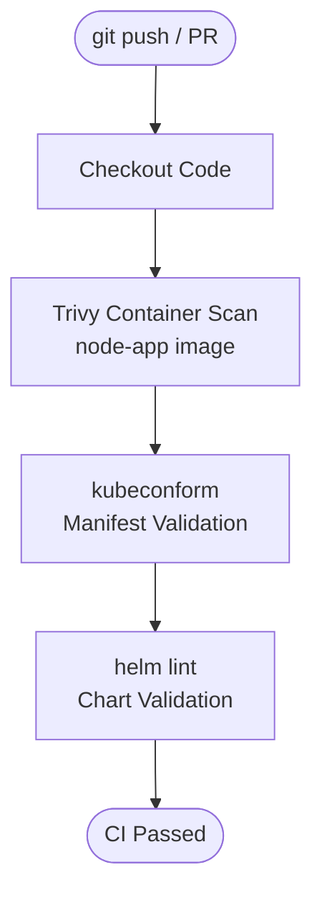
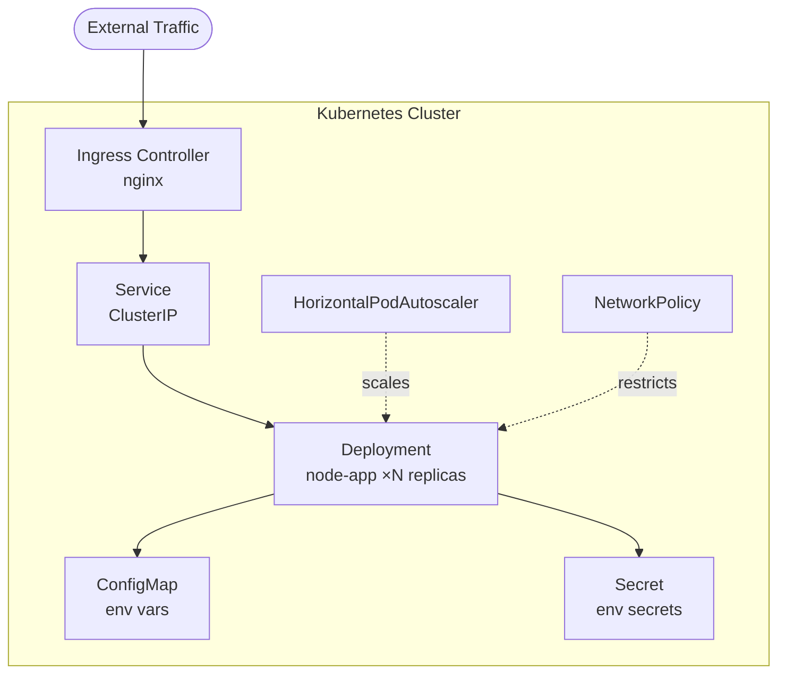
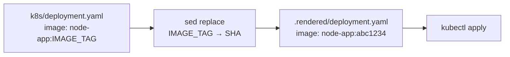
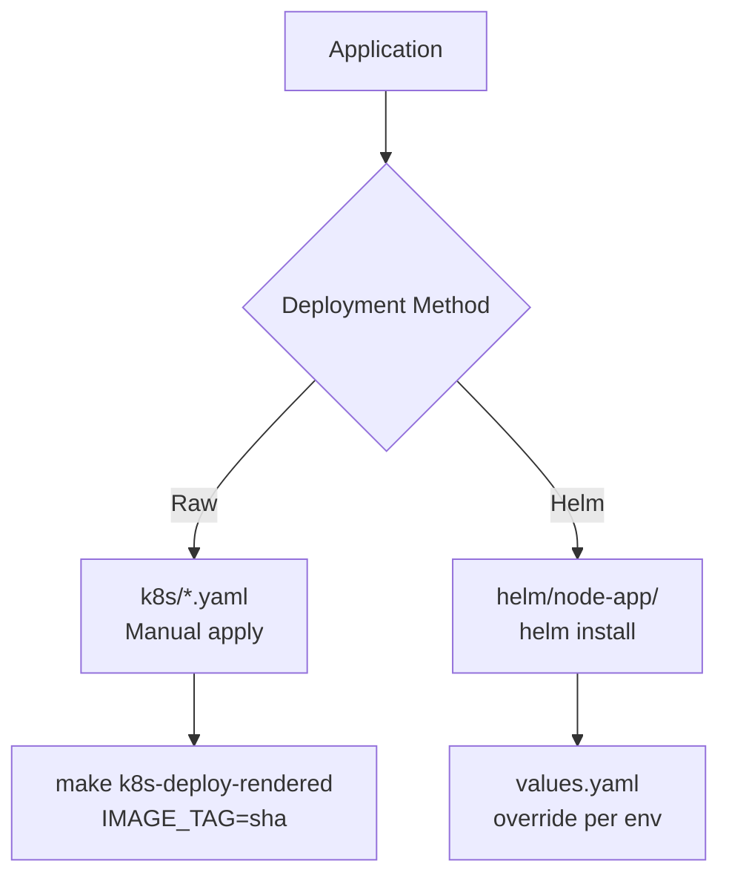

# Architecture — Kubernetes Application Deployment

## CI/CD Flow

```mermaid
flowchart TD
    Push([git push / PR]) --> Checkout[Checkout Code]
    Checkout --> Trivy[Trivy Container Scan\nnode-app image]
    Trivy --> Kubeconform[kubeconform\nManifest Validation]
    Kubeconform --> HelmLint[helm lint\nChart Validation]
    HelmLint --> Done([CI Passed])
```

## Kubernetes Architecture

```mermaid
flowchart TD
    Internet([External Traffic]) --> Ingress[Ingress Controller\nnginx]
    Ingress --> SVC[Service\nClusterIP]
    SVC --> Deploy[Deployment\nnode-app ×N replicas]
    Deploy --> CM[ConfigMap\nenv vars]
    Deploy --> Secret[Secret\nenv secrets]
    HPA[HorizontalPodAutoscaler] -.scales.-> Deploy
    NP[NetworkPolicy] -.restricts.-> Deploy
    subgraph cluster["Kubernetes Cluster"]
        Ingress
        SVC
        Deploy
        CM
        Secret
        HPA
        NP
    end
```

## Image Tag Injection Flow

```mermaid
flowchart LR
    Src[k8s/deployment.yaml\nimage: node-app:IMAGE_TAG] --> Sed[sed replace\nIMAGE_TAG → SHA]
    Sed --> Rendered[.rendered/deployment.yaml\nimage: node-app:abc1234]
    Rendered --> Apply[kubectl apply]
```

## Helm vs Raw Manifests

```mermaid
flowchart TD
    App[Application] --> Choice{Deployment Method}
    Choice -->|Raw| Manifests[k8s/*.yaml\nManual apply]
    Choice -->|Helm| Chart[helm/node-app/\nhelm install]
    Manifests --> Rendered[make k8s-deploy-rendered\nIMAGE_TAG=sha]
    Chart --> Values[values.yaml\noverride per env]
```

[← README](../README.md)
